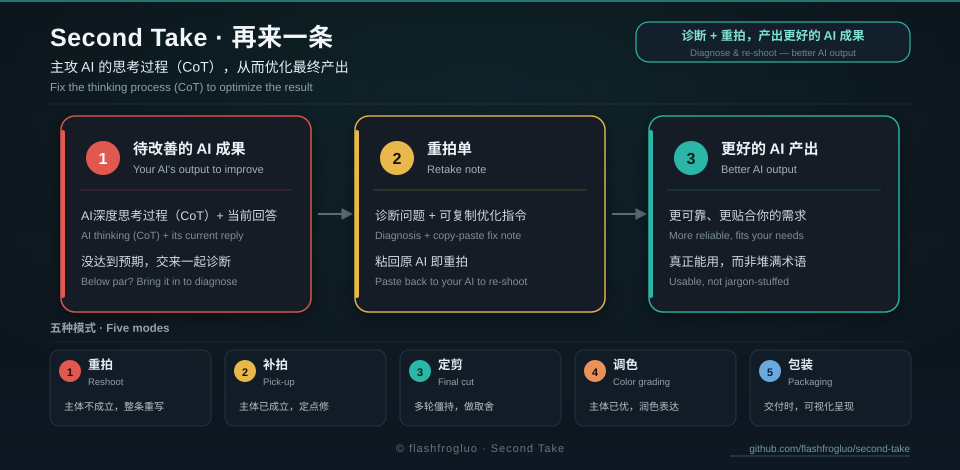
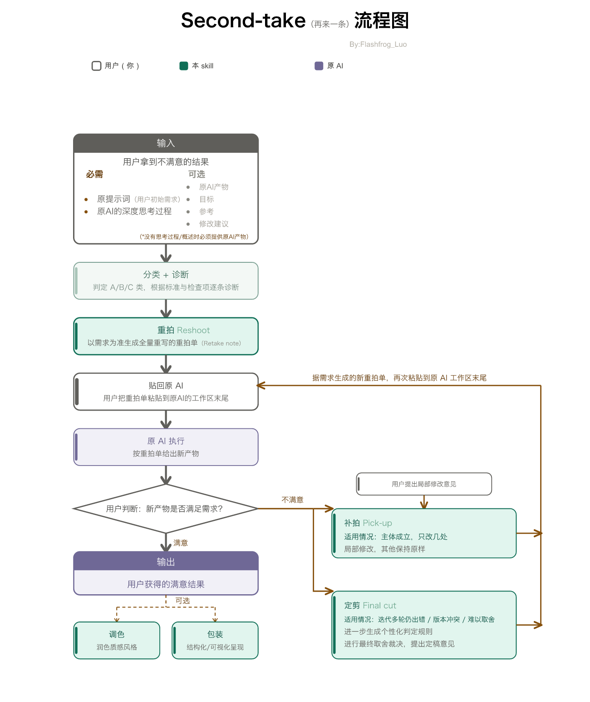

# Second Take · 再来一条

🇨🇳 中文 ｜ 🇬🇧 [English](README_EN.md)

[](https://github.com/flashfrogluo/second-take)
[](LICENSE)
[](CHANGELOG.md)
[](https://agentskills.io)
[](https://github.com/flashfrogluo/second-take/releases)
[](https://github.com/flashfrogluo/second-take/commits/main)
[](https://github.com/flashfrogluo/second-take/actions/workflows/ci.yml)

[](https://github.com/flashfrogluo/second-take)
## 它解决什么问题

**AI 给的结果不满意，你只能反复说「再改改」，但说不清哪里不对。**

Second Take 做一件事：**把「哪里不对」诊断出来，写成一段能直接粘回原对话的指令**，让那个 AI 重出一版。

| 没有它 | 有它 |
|---|---|
| 「不对，重写」 | 「第三段把用户的猜测写成了事实；删掉那两句，其余保留」 |
| 改完又丢了好内容，越改越差 | 只动点名的地方，未点名的一律保留 |
| 每次都要重述一遍需求 | 一段指令带完整需求，粘过去就行 |

**它不替你写答案。** 你在原对话里有上下文、有历史、有要留存的东西，答案应该在那边产出——它只负责把「怎么让那边改对」讲清楚。

📖 **上手手册**（含五种模式的完整走法）：[https://flashfrogluo.github.io/second-take/](https://flashfrogluo.github.io/second-take/)

若在 DeepSeek 上用，可直接取用 [`prompts/for-deepseek.md`](prompts/for-deepseek.md)——为它的思考模式调过；其他平台用 [`prompts/abc.md`](prompts/abc.md)。英文读者用对应的 `prompts/for-deepseek-en.md` 与 `prompts/abc-en.md`。

---

## 30 秒试一下（不用安装）

把 [`prompts/for-deepseek.md`](prompts/for-deepseek.md) 整段复制，作为新对话的第一条消息发出去，然后把你不满意的结果和它背后的思考过程贴给它。

想要完整版（11 份参考文档 + 43 条自查 rubric + 五种模式）再安装：

```bash
npx skills add flashfrogluo/second-take
```

支持 Claude Code、Codex、Cursor、Gemini CLI、GitHub Copilot、Windsurf、Cline、Zed、Goose、OpenCode 等几十种 agent。

**不在这份清单里、照样能用的**：本 skill 本体只是一份 Markdown，**任何能读 `SKILL.md` 的运行时都能用**——WorkBuddy、DeepSeek Harness 就属这一类（它们不走 skills CLI，直接读自己的 skills 目录，路径见下表）。

> ⭐ **如果它帮到你了，点一下右上角的 Star** —— 会进入你账号的 Stars 列表，方便随时找回；点 **Watch** 可订阅更新。这是目前唯一能让我知道「有人在用」的信号。

---

## 流程图：五种模式一条工作流



> 上方是**中文版**；英文版见 [`docs/assets/workflow-en.png`](docs/assets/workflow-en.png)。
> 源文件（SVG / Mermaid）与设计规范在开发工作区，不随本仓库发布。

## 为什么叫 Second Take

take 有两层意思——影视里指"一条拍摄"（再来一条），也指"看法、解读"（my take on this）。这个名字同时说明我们做的两件事：**给出第二种看法，然后让原 AI 重拍一次**。

## 把一次 AI 生成当作拍一部电影（术语与操作面板）

> 这套方法把整套质检流程"封装"成了电影制作：你不必记 AI 专业的术语，只要认得下面的影视说法，就能点名要它做哪一步。

**可以点名的只有五个模式——这张表就是你的操作面板**：

| 模式 | 什么时候用 | 点名时说这些词 |
|---|---|---|
| **重拍 Reshoot** | 首轮，或上一版主体不成立（结构有误、目标判错、大面积漏项） | `重拍` · 从头写 · 推倒重来 · 全量重写 · 这版完全不对 · 重来 · 另起一版 |
| **补拍 Pick-up** | 迭代轮次，上一版主体已成立 | `补拍` · 在这版基础上改 · 只调这几处 · 补充一点 · 沿用这版 · 微调 · 迭代 |
| **定剪 Final cut** | 已经迭代多轮还在出新错，或前后两版结论互相打架 | `定剪` · 帮我取舍 · 选哪个 · 定稿 · 裁决一下 · 拍板 · 合并冲突 |
| **调色 Color grading** | 四标准已过、只差质感或风格 | `调色` · 再润色 · 调语气 · 更有画面感 · 风格统一 · 打磨 · 提质感 · 美化 |
| **包装 Packaging** | 整体已达输出标准，要给别人看 | `包装` · 做个图 · 可视化 · 思维导图 · 对比表 · 信息图 · 看板 · 脑图 |

> 不说这些词也行——工具会按上下文自动判断该走哪一步。五个模式各做什么、按什么顺序推进，见下方「[五种模式：一条完整工作流](#五种模式一条完整工作流从对不对到讲得清)」。

> 📌 **交付物叫什么**：本工具交付的是**重拍单**（Retake note）——一张可整段复制、粘回原对话的单子。
> 通俗点说，它就是一段**优化指令**：自包含、不依赖任何上下文，粘过去对方 AI 直接给出更好的最终答案。
> 本页正文统一用「重拍单」。

> ⚠️ **一个边界**：这些影视词是**你调用本工具的指令接口**，不是你交给 AI 的任务内容。如果你的需求本身就是"拍电影"、文案里出现了"重拍/调色"，那只是你的业务语言，不会触发本工具的环节——触发只发生在你主动使用本工具时。

**其余影视说法不是模式，不能点名**，它们只是环节名，出现在诊断报告里：

| 影视说法 | 指什么 |
|---|---|
| **Dailies / 样片** | 待审素材：原 AI 的推理链与最终答案 |
| **Continuity / 穿帮** | 自洽性检查：各步骤内部、步骤之间、步骤与结论是否自洽 |
| **Missing coverage / 漏镜** | 覆盖不全：是否漏掉关键分支或影响因素 |
| **Retake note / 重拍单** | 交付物本身（见上方说明） |

> **检查项**（自洽性 / 覆盖不全）是**诊断用的**，不归五模式，也不会出现在触发词里。

## 触发词清单（怎么唤起本工具）

> 本工具靠两类词被唤起：**总触发词**让你进入流程；**模式触发词**（见上一节的操作面板）让你点名要走哪一步。

### 总触发词

| 意图 | 触发词 |
|---|---|
| 结果不满意（质检） | 结果不对 / 很难用 / 漏了要点 / 字数不达标 / 输出不像人话 / AI 味太重 / 格式不对 / 答非所问 / 逻辑有问题 / 前后矛盾 |
| 给材料让我诊断 | 帮我看看这段思考 / 诊断这个推理 / 这段深度思考哪儿错了 / 贴分享链接 / 这是我的提示词出图不对 |
| 优化改写 | 优化提示语 / 让原 AI 重写一遍 / 挑错 / 复盘 / 复核 / 改写深度思考 / 用这份 rubric 帮我质检 |
| 生成类平台 | 即梦/可灵/Midjourney 出图不对 / 画面不是想要的 / 提示词重拍单 |

## 30 秒上手：一段最短演示（示意）

> 可直接复制的重拍单模板见 `references/标注范例.md`；下面是一段浓缩示意，便于一眼看懂产出形态（示意内容不指代任何真实案例）。

**输入**：用户要一份「给新手的三条摄影构图建议」，某 AI 的深度思考里写了「根据视觉暂留原理，三分法能让画面更顺眼」，并且只给了两条建议。

**诊断（节选）**
- **无据引用（跨领域生搬）**：把「视觉暂留」当依据，那是解释动态画面连续感的生理现象，与静态构图的三分法无关，属生搬硬套；
- **覆盖不全**：原始指令明确要求三条，只给了两条。

**重拍单（整段复制，粘到原对话末尾）**
> 忽略本对话中上一轮那段深度思考及其产物，其余指令继续有效。重写「给新手的三条摄影构图建议」：① 三分法……② 引导线……③ 留白……。禁止使用「视觉暂留」等跨领域无关论据；只输出正文，不输出分析过程。

**结果**：原 AI 直接给出三条带可操作要点的建议，无生搬硬套的论据。

## 交付内容

> **EN** — Deliverables: a copy-ready optimization instruction plus a short diagnosis. We do not write the answer for you; you run it in the original chat.

1. **一段可以复制的重拍单**（核心交付物）。粘回原对话末尾，对方 AI 会直接给出最终答案，不会再回你一份"分析"或"建议"。
2. **十几行的诊断**，说明原推理错在哪、这版指令改了什么。

本 skill **不会**替您把答案写出来。您的上下文在那个 AI 的对话里，必须在那边拿结果。要它直接写，说一句"你直接写"就行。

重拍单是自包含的：你当初给的指令全文嵌在里面，整段复制走也不依赖任何上下文。它**不嵌入原始那段深度思考**——里面的臆测和"思考腔"正是问题根源，贴进去模型就会照着重演一遍思考过程。我们只给：你当初给的指令 + 有效结论清单（从那段深度思考里提炼出的成立判断）+ 修改要点 + 输出结构骨架（分几节、每节写什么、多长，结论放前面、关键处加粗）+ 输出要求（含禁用思考腔）。

产出什么要按你给的指令判断，别猜：如果那个要求是提问或要一份内容，就产**最终回答**；如果它要的交付物本身就是推理过程（提示词工程里思考过程即产物），就产**改写后的思考过程**。两个模板都在 `references/标注范例.md`。

直接粘在**原始对话末尾**就行，不用开新对话。重拍单开头自带**定向忽略声明**：只切掉那段不合格的深度思考，以及由它直接产出的一版回答；您之前提出的指令、追加要求、表达习惯和思维方式全部继续有效。

这个方法不限领域。它的审查逻辑跟"产物是什么"无关——文案、方案、代码、分析结论、评分标准都同样适用。本 skill 的所有规则都经过抽象，只保留跨领域成立的机理；任何只在单个领域成立的写法都不写进来。

## 适用场景

> **EN** — When to use it: verify a model's reasoning follows your instructions; catch unsupported claims, forced logic, and factual errors; QA prompts before batch generation.

- 检查模型输出的思维链是否忠实于用户指令
- 找出推理中的无据引用、强行推理、常识性错误
- 在做批量生成前，对提示词/推理过程做质检
- 把"挑毛病"的经验固化成可复用的流程

## 适用模型与产物类型

> **EN** — Supported across all major AIs (DeepSeek, ChatGPT, Gemini, Claude, Midjourney, Sora…) and all output types: text, image, video, and other artifacts — a multi-model, multimodal workflow.

不管您用哪一款 AI——**DeepSeek、ChatGPT、豆包、通义千问、Gemini、Claude、即梦、可灵、Midjourney、Sora、Runway……**（多模型、多模态，覆盖文本推理与图 / 视频生成）——只要它产出的结果您不满意，Second Take 都能接。覆盖的产物类型也不受限：

- **文字类**：文案、方案、代码、分析报告、评分标准（rubric）、论文 / 报告
- **图像类**：生图、海报、分镜、封面
- **视频类**：短片、广告、分镜预览、动态素材
- **其他产物**：提示词、配置、表格，以及任何一段"想完了但没想好"的推理

唯一的判断标准：**那个 AI 有没有把推理过程露出来**。

| 类 | 代表 AI | 我们审查什么 | 给您什么 | 产物类型 |
|---|---|---|---|---|
| **A 完整推理** | DeepSeek、通义千问（思考模式）、Gemini、豆包、Claude | 那段深度思考 | 重拍单（粘贴回原对话） | 文字 / 其他 |
| **B 仅推理摘要** | ChatGPT（thinking summary）、部分豆包 / 千问分享快照 | 摘要 + 从产物反推（注明来源） | 重拍单 | 文字 / 其他 |
| **C 无推理（生成类）** | 即梦、可灵、Midjourney、Sora、Runway | **提示词本身** | 提示词重拍单（可直接粘贴） | 图像 / 视频 |

> C 类是本 skill 特意做的适配：生成类模型不给你看推理，但**提示词就是它收到的全部指令**——把它当深度思考来审，出图 / 出片不对的根因同样查得到（漏要素、内部冲突、形容词没操作化、用了平台不认的词）。三条规矩：不编造平台参数、保留 seed 与参考图、只改出问题的要素、不推翻整张图。

## 不同产物类型，提供哪些信息最准

> **EN** — What to provide for the most accurate diagnosis, by output type (text/code, summary-only, image/video, with reference, or any type).

给的信息越准，诊断就越准。按产物类型提供以下内容；缺了也能先跑、再补：

| 要审的内容 | 尽量提供（越多越准） | 作用 |
|---|---|---|
| **文字 / 代码 / 方案** | ① 你当初给的指令 ② 那段深度思考 ③ 它最终给出的回答 | 深度思考是主证据；原始指令用来核对"漏了哪条要求"；最终回答用来确认"错有没有带进结果" |
| **只有摘要（ChatGPT 等）** | ① 你当初给的指令 ② 思考摘要 ③ 最终产物 | 主证据换成产物，结论注明"由产物反推"，并写明"没见到完整推理，覆盖度可能偏低" |
| **图像 / 视频（生成类）** | ① 你期望的效果 ② 用的提示词（含参数 / seed / 参考图）③ 本版出图 | 提示词即推理；seed / 参考图决定能不能"只改出错的要素" |
| **带参考 / 目标素材** | ① 目标（您期望的样貌）② 参考（取被点名的那一维）③ 待改的 AI 产物 | 三者要分清，防止"怪圈"：如果把 AI 产物当标准，就会越改越像原错 |
| **任意类型** | 一句"哪里不满意" | 帮我们先做完判定、少绕路；没说我们也能从原始指令和产物反推 |

## 隐私保护

> **EN** — Privacy: runs fully locally, never uploads your chats or materials; shared content is used only for this diagnosis.

- 本 skill 在**本地**运行，不联网、不上传您的任何对话或素材；诊断用的内容只存在于您这次对话里。
- 您贴进来的需求、对话、提示词、出图，**只用于这次诊断**，不会被收集、训练或外传。
- 如果您自愿把脱敏后的案例贡献出来（见下节），那是您**主动**提供的，跟自动采集没关系。

## 共建此项目：欢迎贡献您的案例与语料

> **EN** — Contributing: send us sanitized failure cases (instructions + reasoning/prompt + what went wrong) to help sharpen the rules.

本 skill 的硬约束，是从真实案例里一条条磨出来的。**如果您愿意把遇见的"不满意结果"连同原始指令 / 提示词分享给我们，能帮我们把判定打磨得更准**——请发邮件到 **flashfrogluo@gmail.com**，或在仓库提交 issue / PR。

- 贡献前请**先脱敏**：去掉真实姓名、客户名、内部地址、涉密数据；留"任务类型 + 指令 + 那段推理 / 提示词 + 您哪里不满意"就行。
- 您的案例不会自动进入公开知识库；只有被抽象成"机理"的规律才会回流，具体名词会被删掉——既能帮我们，也不会泄露您的业务。
- 使用建议、测评反馈、合作意向，也都欢迎。

## 一次完整的往返

> **EN** — One round-trip: you paste a bad output or share link → we return a diagnosis + retake note → you paste it back → the AI gives a better answer.

```
您  →  贴一段不满意的 AI 输出，或它的对话分享链接
它  →  ① 十几行诊断：错在哪条、归哪一类、按四标准给总评
       ② 一张重拍单（代码块，整段可复制）
您  →  将重拍单粘贴回原 AI 的对话末尾
该 AI → 直接给出更好的最终答案
```

关键是**您不用重写问题**：原始对话里的上下文、历史、表达习惯全部保留，被切掉的只有那段不合格的推理。

## 安装

> **EN** — Install: `npx skills add flashfrogluo/second-take`, or drop the folder into your agent's skills directory.

### 一句话装到任何 agent（推荐）

> **EN** — One-line install works with Claude Code, Codex, Cursor, Copilot, Gemini CLI, and dozens of other agents.

```bash
npx skills add flashfrogluo/second-take
```

skills CLI 自身支持 Claude Code、Codex、Cursor、GitHub Copilot、Windsurf、Gemini CLI、Cline、Zed、Goose、OpenCode 等 58 个 agent，装的时候选目标即可。**它不覆盖的运行时，把文件夹放进对方的 skills 目录一样能用**（见下表末两行）。

### 各平台的发现路径（手动装时用这张表）

> **EN** — Manual install paths per agent (project-level and user-level). One master copy + symlinks is the recommended setup.

| Agent | 项目级 | 用户级 |
|---|---|---|
| **Claude Code** | `.claude/skills/` | `~/.claude/skills/` |
| **Codex CLI** | `.agents/skills/` | `~/.codex/skills/` |
| **Cursor** | `.agents/skills/` | `~/.cursor/skills/` |
| **Windsurf** | `.windsurf/skills/` | `~/.codeium/windsurf/skills/` |
| **Cline** | `.agents/skills/` | `~/.agents/skills/` |
| **Zed** | `.agents/skills/` | `~/.agents/skills/` |
| **Gemini CLI** | `.agents/skills/` | `~/.gemini/skills/` |
| **GitHub Copilot** | `.agents/skills/` | `~/.copilot/skills/` |
| **OpenCode** | `.agents/skills/` | `~/.config/opencode/skills/` |
| **Goose** | `.goose/skills/` | `~/.config/goose/skills/` |
| **WorkBuddy** | — | `~/.workbuddy/skills/` |
| **DeepSeek Harness** | `.agents/skills/` | `~/.agents/skills/` |

> 前 10 行路径取自 `skills` CLI 自身的 agent 定义（v1.7.1）；**WorkBuddy 与 DeepSeek Harness 为实测补充**
> （前者：`~/.workbuddy/skills/` 下已实际装有本 skill；后者：用户 skill 走 `.agents/skills/` 标准路径，
> 与应用内置的 skill 并列出现在同一份清单里）。
>
> **多数 agent 都会读 `.agents/skills/`**——手动装时放这一处通常就够了。没列到的 agent 见各自官方文档。

**一份主副本 + 软链接**（多个 agent 共用时的标准做法，避免多份副本各自漂移）：

```bash
mkdir -p .agents/skills .claude
cp -R second-take .agents/skills/
ln -s ../.agents/skills .claude/skills     # Claude Code 支持目录软链接
```

用户级同理：`~/.agents/skills/` 放真身，`~/.claude/skills` 与 `~/.workbuddy/skills/second-take` 指向它。
Windows 建软链接需要开发者模式，若嫌麻烦就复制一份并在 `.gitignore` 里排除副本。

### 仅作为提示词使用

> **EN** — Prompt-only use: paste SKILL.md into any chat; the references/ files are optional supplements.

把 `SKILL.md` 的正文直接贴进对话即可，`references/` 下的文件作为可选补充材料——需要完整模板读 `标注范例.md`，需要自检段写法读 `成稿自检清单.md`，需要混合模式读 `自生成rubric元指令.md`，需要把新经验回灌进本 skill 读 `经验提炼与思维习惯.md`。

不想自己剪 SKILL.md 的，有现成**精简应急版**可直接用：

- **`prompts/for-deepseek.md`【应急版】**｜**`for-deepseek-en.md`**（英）—— 为 DeepSeek（A 类）调好的自包含提示词，保留 A 类流程、检查项、四条标准、模板 A 与 **14 条高频硬约束**（完整版为 34 条）。复制整段作为 DeepSeek 新对话第一条消息，之后把不满意的答案加它的深度思考贴进去，它就会产出可粘回原对话的重拍单。
- **`prompts/abc.md`【应急版】**｜**`abc-en.md`**（英）—— 通用版，覆盖 A（完整推理）/ B（只有摘要）/ C（无推理、提示词质检，如 Midjourney / 即梦 / 可灵）三类；复制整段作新对话首条消息，按提示先判类型再出重拍单。

> ⚠️ 这四份都是**精简应急版**，约占完整 skill 的一小部分。复制能解决「这一次」；完整版（`npx skills add flashfrogluo/second-take`）额外含 11 个 references、43 条自查 rubric 与各平台一键安装，装上才能「每一次」都拿到带全量质检的重拍单。
> 中英两版的规则内容一致（同为 14 条高频硬约束子集），只是语言不同。

> **EN** — For prompt-only use without trimming SKILL.md yourself: **`prompts/for-deepseek.md`** / **`for-deepseek-en.md`** is a self-contained prompt tuned for DeepSeek (Type A); **`prompts/abc.md`** is the generic version covering Type A (full thinking process) / B (summary only) / C (no thinking process, prompt-quality-check, e.g. Midjourney / Jimeng / Kling). Copy the whole block as the first message of a new chat. Both are **lite "starter" versions** — the full skill (`npx skills add flashfrogluo/second-take`) adds 11 references, a 43-item self-check rubric, and one-line install across platforms.

## 兼容性说明

> **EN** — Compatibility: follows the open agentskills.io standard; core quality-check flow is pure Markdown with no system deps; only optional share-link fetching needs curl.

- 遵循 **agentskills.io** 开放标准：规范共 6 个字段（`name` / `description` / `license` / `compatibility` / `metadata` / `allowed-tools`），本 skill 用到前 5 个，未用 `allowed-tools`，也没用任何平台私有字段（如 Cursor 的 `paths`、Codex 的 `agents/openai.yaml`），因此不会被其他运行时静默剥离
- 目录名与 `name` 严格一致：`second-take`
- 引用 `references/` 一律用相对路径，不含任何本机绝对路径
- 核心质检流程纯 Markdown、无系统依赖；仅可选抓取分享链接需 curl，工程脚本（校验/安装）不参与质检运行——安装即信任

## 用法

> **EN** — Usage: paste a share link, or paste the user instruction + thinking process directly. Optional inputs: caption, target, reference, follow-up instructions.

以下两种方式均可：

```
# 提供链接（最常见）
帮我生成重拍单：https://chat.deepseek.com/share/xxxxx

# 直接粘贴内容
帮我检查这一段深度思考是否正确，若不正确或尚可优化，请帮我生成重拍单。
用户指令：……
深度思考：……
```

给链接后，它会自动调接口拿原始指令、深度思考和那版产物，不用您手动输入。拿到后会先跟您确认主指令、追加指令、产出物分别是哪条。

可选输入包括：素材描述（Caption）、目标产物、参考素材，以及您在后续轮次追加的指令（比如"不要分点，输出一长条"）。缺哪一项，依赖它的检查项就直接判"无"。

只有用户指令和深度思考、没有产物和素材的纯文本问答场景也适用，这时检查重点落在指令冲突、覆盖不全、推理缺陷三项。

## 评价标准：有效思维链的四条标准

> **EN** — The Four Standards for an effective chain of thought: Logic, Completeness, Feasibility, Verifiability. Standards judge quality; check items list symptoms.

一段思维链是否有效，按四条标准评价。**四条标准是评价标准，检查项是症状清单**——前者回答「它好不好」，后者回答「哪儿坏了」。

| 标准 | 定义 | 一句话判据 |
|---|---|---|
| **逻辑性** | 每个思考步骤之间有逻辑关系，互相连接，形成完整的思考过程 | 后一步能不能从前一步推出来 |
| **全面性** | 尽可能全面、细致地考虑问题，不忽略可能的因素和影响 | 用户指令和素材里提到的重要维度，是不是都想到了 |
| **可行性** | 每个思考步骤都能被实际操作和实施 | 读完知不知道下一步具体做什么 |
| **可验证性** | 每个思考步骤都能通过实际的数据和事实验证其正确性和有效性 | 每条结论能不能指出「凭什么这么说」 |

流程：先按检查项找出具体错误 → 归口到四条标准 → 给总评 → 据此写重拍单。修改要点必须覆盖四条，缺哪条补哪条。

逐条的判定方法、与检查项的映射表见 `references/思维链四标准.md`。

## 症状清单（检查项）

> **EN** — Symptom list (check items): the skill scans for three families of problems — conflicts, coverage gaps, reasoning defects. The full itemized list lives in `references/思维链四标准.md`.

本工具会自动扫描三类问题，你不必记下这些术语：

- **冲突**：产物、参考素材、用户指令之间互相打架（产物冲突 / 参考冲突 / 指令冲突）；
- **覆盖不全**：用户指令里的重要内容被漏掉或弱化；
- **推理缺陷**：前后矛盾、常识性错误、表述模糊、强行推理、无据引用、自我放行、版本退步等。

完整条目与逐条判定方法，见 `references/思维链四标准.md`。

## 目录结构

> **EN** — Repository layout: SKILL.md, references/ (11 deep-dive docs), and docs/ (pointers + maintainer guide + this manual's English counterpart).

```
second-take/
├── SKILL.md              # 主流程：输入、纪律、检查项、34 条硬约束要点、执行步骤
├── README.md / README_EN.md / CHANGELOG.md / LICENSE
├── references/           # 11 份参考文档 —— 见下表
├── docs/                 # 说明书与维护文档 —— 见下表
├── prompts/              # 四份「精简应急版」提示词（中/英）—— 见下表
├── tests/                # validate.py（结构校验）+ samples/（7 个样例 JSON）
├── scripts/              # 维护脚本：release / push / sync / stats / patch_*
└── metrics/              # 历史统计留档（GitHub Traffic 只有 14 天窗口）
```

**references/（11 份，全部按需读取）**

| 文件 | 内容 |
|---|---|
| `硬约束详解.md` | 34 条硬约束的完整解释、反例与正确写法 |
| `多场景适配.md` | DeepSeek / ChatGPT / Gemini / 生成类平台各能拿到什么、怎么改 |
| `判定细则.md` | 判定顺序、归属规则、豁免清单、子类边界 |
| `思维链四标准.md` | 四标准唯一真源：定义 + 逐条判定 + 映射 + 五模式 / 两机理 / 边界 |
| `标注范例.md` | 可直接复制的重拍单模板 A/B/C（占位符、无案例） |
| `成稿自检清单.md` | 给目标 AI 用的自检段：写法规范与条目模板 |
| `自生成rubric元指令.md` | 混合模式：让目标 AI 自己写领域标准的元指令 |
| `优化指令自查rubric.md` | 我们交付前用的五字段自查表（Must-have 18 条） |
| `经验提炼与思维习惯.md` | 案例如何抽象成规则、防污染纪律、固定心智动作 |
| `画面描述规范.md` | caption 写作原则与八条判定（脱敏自通用规范） |
| `术语表.md` | 评测侧术语：Rubric 五字段、四类硬伤、reward hacking |

**docs/ 与 prompts/**

| 路径 | 内容 |
|---|---|
| `docs/使用与迭代.md` | 面向用户：怎么用、反馈怎么进下一版 |
| `docs/迭代工作流.md` | 维护者指南：改硬约束 / 加 reference / 补语料 / 发布 checklist |
| `docs/guide-en.md` | 完整英文使用说明书 |
| `docs/ROADMAP.md` | 路线图：已完成 / 进行中 / 设想中 |
| `docs/四标准质检法.md` | 入口指针：已合并至 `references/思维链四标准.md`，勿在此写内容 |
| `docs/index.html` + `docs/assets/` | GitHub Pages 落地页；主视觉 `hero.svg`；**流程图** `workflow-zh.png` / `workflow-en.png` |
| `prompts/for-deepseek.md` / `-en.md` | 【精简应急版】DeepSeek（A 类）现成提示词（中 / 英） |
| `prompts/abc.md` / `-en.md` | 【精简应急版】通用 A/B/C 三类提示词（中 / 英） |

> 另有 `install.sh` / `update.sh`（安装与升级）、`scripts/`（发版、推送、同步、统计）、`metrics/`（历史统计）、`.github/`（CI 与治理文件）。

## 默认给轻装版（交付形态 vs 模式）

本工具默认交付**轻装版**：诊断照旧满配，交付默认精简——最常见的情形是**定点修复**（上一版主体已成立，沿用好的、只改几处）。完整版（全量重写、逐条诊断、成稿自检、18 条自查）按需才给：用户说「重要 / 详细点 / 往深了查」，或问题明显结构性（多处不对、方向错、已改好几轮还不行）。

注意区分两层概念，不要混：

- **交付形态**：轻装版 / 完整版——回答「这版写多长」，默认轻装版。
- **模式（Reshoot / Pick-up / Final cut / Color grading / Packaging）**：只在走完整版路径时选择，回答「用哪套质检流程」。

所以「默认走 Reshoot」的准确说法是：**完整版路径下默认走 Reshoot**；默认交付的是轻装版（多为定点修复，对应 Pick-up 思路）。两句不矛盾，只是说的不是同一层。

## 五种模式：一条完整工作流，从「对不对」到「讲得清」

> **EN** — Five modes: Reshoot (full rewrite), Pick-up (fix only named spots), Final cut (arbitrate after deadlock), Color grading (polish style), Packaging (visualize & present).

不是每轮都要推倒重来。先判断主体成不成立，再选模式：

| 模式 | 影视说法 | 适用时机 | 做法 |
|---|---|---|---|
| **Reshoot** | 重拍 | 首轮，或上一版主体不成立（结构有误、目标判错、大面积漏项） | 全量重写 |
| **Pick-up** | 补拍 | 迭代轮次，上一版主体已成立 | 仅修改被点名的数处，其余按原样沿用 |
| **Final cut** | 定剪 | 已经迭代多轮还在出新错，或前后两版结论互相打架 | 不再重写，做取舍裁决 |
| **Color grading** | 调色 | 主体已完美（四标准达标、无检查项问题），只差质感 / 风格 | 不动结构与事实，只做轻微润色与风格强化：文本类锤炼措辞、统一语气、强化节奏与画面感、点亮关键句；图像/视频提示词类收紧风格/光线/情绪等视觉描述词、强化美学方向，不变主体、不增删元素 |
| **Packaging** | 包装 | 整体已达输出标准，需结构化呈现、让人一眼看懂 | 做可视化分析：输出总结、思维导图、可视化图表（流程 / 对比 / 关系 / 时间线） |

按生产流水线推进：**重拍 → 补拍 → 定剪 → 调色 → 包装**。前三种解决「对不对」，调色解决「够不够好」，包装解决「讲不讲得清」。**调色与包装都不重判结论**——调色只润色表达或视觉呈现、不引入新观点、不改动事实与结构（图像/视频提示词只调视觉描述词、不换主体、不增删元素）；包装只呈现已有结论、忠于原判断、不为美观扭曲关系。两者都建立在「主体已经达标」之上；四标准尚未全过，先走前三种，不要跳去调色或包装。

**完整版路径下**默认走 Reshoot；**第二轮之后默认走 Pick-up**——重写最大的风险，是把上一版已经合格的内容一起丢掉（版本退步）。

## 重拍单末尾的三段（混合模式）

> **EN** — The retake note ends with three fixed segments: [Judging Criteria], [Known Defects], [Self-Check].

重拍单不是写完要求就结束，末尾还有三段，顺序固定：

| 段 | 撰写方 | 作用 |
|---|---|---|
| **【判定标准】** | 目标 AI 按我们给的规范自行撰写 | 事前先定义"这个领域什么叫好"，防止我们没见过的错 |
| **【已知缺陷】** | 我们（种子条目） | 锚住上一版实际犯过的错——它不知道自己删了哪一条 |
| **【成稿自检】** | 我们（10–12 条 Yes/No） | 写完统一过一遍，答"否"的当场改，自检过程不进正文 |

为什么不干脆全由我们写：我们的条目是**事后视角**（看了坏产物才写出来），只能防住见过的错；它自写的是**事前视角**（拿到指令先定义标准），能防住没见过的错。**两者覆盖的是不同的错误集合。**

为什么不能全交给它：它会自我评分膨胀，还会**从上一版的坏产物反推标准**（把"上版分六节"当成标准），写出"内容是否合理"这种判不了的条目。所以元指令必须带护栏——**每条都要写明"凭什么判"，没写依据就算"否"**；**标准只能来自你给的指令和常识，不能来自之前任何一版回答的样子**；禁用裸形容词。

**「混合模式」**指这一节：领域标准由目标 AI 自写（事前视角），已知缺陷由我们给种子条目（事后视角），两份合并。

默认启用三段。四种情形退回只给【成稿自检】：目标模型能力明显薄弱 / 用户指令极简 / 缺陷已完全可枚举 / 用户所需为最短指令。

> ⚠️ **可退的只有【判定标准】与【已知缺陷】。【成稿自检】在任何模板（A / B / C）与任何情形下都必带**——它防的是"写完不看一遍"，与产物长短无关。

## 实践中踩过的坑（都已写进硬约束）

> **EN** — Hard-won lessons now baked into the hard constraints (e.g. never embed the raw thinking process; never drop qualified content on a rewrite).

| 教训 | 症状 |
|---|---|
| 内嵌深度思考全文 | 输出变成"嗯，用户问的是……"式的思考过程，而不是答案 |
| 骨架只写"可分节" | 产出没有层级、没有重点的平铺文字 |
| 元要求进正文 | 正文出现"本回答的工作定义""判断标准是…"，读者分不清在跟谁说话 |
| 为"可检验"编数字 | 编出精确的轮询间隔、验收岗位名，一眼假，整篇可信度跟着塌 |
| 机械量化指标 | "每节至少两处加粗"→ 通篇加粗；限定列数 → 字段被两两合并 |
| 清单不同源 | 修改要点列七类、输出结构列六类 → 模型按结构执行，第七类整条消失 |
| **结构里没占位** | 只写于修改要点中的要求（如收尾询问段）根本不会被产出 |
| 迭代时推倒重写 | 把上一版已有的合格内容一起丢掉（版本退步） |
| 忽略整段对话 | 一刀切"忽略此前所有回答"，把用户反复强调的习惯也丢了 |
| **为压字数省句子成分** | "也知道"写成"也知"、判断句写成"……而非……"，读者得自己补字才能读通 |
| 论述里每句都以"我"开头 | 主语反复跳转，客观论述降格成主观感受，读起来错乱 |
| 骨架写成要点清单 | 模型把骨架原样抄成提纲，产物变成没有谓语的短语堆砌 |

## 经验怎么沉淀进 skill：抽象，不搬运

> **EN** — How experience is distilled: abstract from cases (symptom→root cause→mechanism→rule), never copy case details. Cross-domain test: swap nouns for placeholders.

每用一次就多一条经验，但**对话案例是测试材料，不是知识**。沉淀顺序固定：**症状 → 根因 → 机理 → 规则**。跳过抽象、直接把案例写进语料，等于拿测试集当训练集，规则会带着那个领域的样子，换领域就被生硬套用。

判断标准只有一条——**换域测试**：把规则里的专有名词全换成占位符再读一遍。

- **仍成立** → 机理，写入 skill；
- **不成立** → 做法，留存于案例文件。

一句话：**删掉名词还剩什么，什么才是能迁移的。**

| 案例里的发现 | 抽象后（入库） | 留在案例文件 |
|---|---|---|
| 迭代重写后某类条目整条消失 | 重写会让上一版合格内容一起丢掉 | 那条条目具体是什么 |
| 样例表的字段被两两合并 | 列数限制与字段数冲突时，模型会合并字段而非增列 | 那张表有哪几个字段 |
| 为凑体量指标牺牲内容 | 可量化指标会被当考核项去"表演" | 那个具体数字是多少 |

## 与同类 skill 的区别

> **EN** — How we differ: third-party QA of another AI's reasoning, producing a note you paste back — not more thinking, not self-editing.

社区里已经有不少"让 AI 做得更好"的 skill，但我们做的不是同一件事：

| 类别 | 代表 | 它们做什么 | 我们做什么 |
|---|---|---|---|
| 生成侧：让 AI 多想 | `adhd`（tree-of-thought + 剪枝）、`Reasoning-Skill-Claude`、`auto-reasoning` | 在**生成时**帮 AI 想得更广、更深 | 在**生成之后**审查它已经想完的那一段 |
| 自我反思侧 | `self-refine-skill`（GENERATE→CRITIQUE→REFINE→CHECK）、`claude-sanity-check` | 让 AI **改它自己**当次的输出 | 第三方审查**另一个 AI** 的推理，且产物要能粘回原对话 |
| 文风侧 | `avoid-ai-writing`（21 类 AI 写作模式）、`humanizer` | 去 AI 味、改措辞 | 判定推理错在哪（漏项、矛盾、无据引用、约束冲突），文风只是其中一维 |
| 提示词侧 | `prompt-architect`、`prompt-engineering-expert` | 改进**提示词本身** | 改进"拿着原始指令重答一遍"的指令，且保留原对话上下文 |

一句话：**别人做的事，是让 AI 多想一层，或者改它自己的文风；Second Take 做的是第三方质检——读另一段 AI 已经想完的推理，判断错在哪，产出一段能粘回原对话、让原 AI 直接给出最终答案的重拍单。**

## 常见问题

> **EN** — FAQ: does it write the answer? (no); why no original thinking process? (it is the problem); does it pollute context? (no); works on code? (yes).

**它会不会直接把答案写出来？**
不会。默认只给重拍单。您的上下文在那个 AI 的对话里，必须在那边拿结果。要它直接写，说一句"你直接写"就行。

**为什么重拍单里没有原来的那段思考？**
因为那段深度思考本身就是问题根源。一旦贴进去，目标模型就会照着重演一遍思考过程，输出变成"嗯，用户问的是……"。我们只给你当初给的指令全文 + 从那段深度思考里提炼的**有效结论清单**。

**粘回原对话会不会污染上下文？**
重拍单自带**定向忽略声明**：只忽略上一轮那段深度思考，以及由它直接产出的那一版回答；您之前提到的指令、追加要求、表达习惯一律继续有效。

**能用在代码上吗？**
能。它的审查逻辑跟"产物是什么"无关，文案、方案、代码、分析结论、评分标准都同样适用。

**迭代到第三轮还在出错怎么办？**
换 Final cut（定剪）模式：不再重写，做取舍裁决。已经迭代多轮还在出新错，说明问题不在"重写得不够好"，而在取舍本身。

**内容都对、就是感觉差点意思，能再润色吗？**
可以，这正是 **Color grading（调色）** 模式：主体已完美、四标准全过之后，不再动结构与事实，只做轻微润色与风格强化。文本类——锤炼措辞、统一语气、强化节奏与画面感、点亮关键句；图像/视频提示词类——收紧风格/光线/情绪等视觉描述词、强化美学方向，但不变主体、不增删画面元素。它只润色表达或视觉呈现，不引入新观点，也不改动事实。

**成品达标了，但我还要拿去汇报 / 发给别人看，能给个一眼看懂的版本吗？**
可以，这正是 **Packaging（包装）** 模式：整体已达输出标准后，做可视化分析——输出一页纸总结、思维导图、以及流程 / 对比 / 关系 / 时间线类的可视化图表。它只呈现已有结论、忠于原判断，不为美观扭曲关系。

**我只有一段深度思考、没有链接，能用吗？**
能。把用户指令和深度思考一起贴进来就行。

## 关于作者

> **EN** — Author: flashfrogluo, a filmmaker turned AI creator; feedback and case contributions welcome at flashfrogluo@gmail.com.

**flashfrogluo** —— 做电影创作出身（电影摄影 / 导演 / 编剧），现在转向 AI 创作、测评和开发，长期在「电影语言」和「AI 工程」两个领域之间来回。

做这个 skill 的直接动机，来自两个身份的交叉：一边是做影像创作时，对"为什么这一镜不对"特别敏感；另一边是日常用各类 AI 时反复遇到同一个痛点——模型给出的「深度思考」质量很不稳定，有时逻辑跳步，有时漏掉用户明确要求过的维度，有时为了迎合语气擅自改了指令；而把那段思考粘回原对话重答，又往往把错因一起带过去。Second Take 想把前者那种"逐镜挑错"的直觉，变成后者的可操作流程：做一次**第三方质检**，读另一段已经想完的推理，判断错在哪，产出一段能直接粘回原对话、让原 AI 给出更好最终答案的「重拍单」。

**欢迎一切交流**：使用建议、测评反馈、能做语料的真实对话、合作想法，都欢迎提 issue / PR，或直接发邮件到 **flashfrogluo@gmail.com**。微信交流群与 X（Twitter）动态也欢迎邮件索取入群 / 关注方式。

最后，感谢您使用这个 skill。它由一个人独立维护，确实不易；但我们承诺，会一直跟着真实需求迭代——您遇到的问题，很可能就是下一版要补的硬约束。您的每一条反馈，都会直接落到下一版的改进里。

## 术语说明

> **EN** — Terms: Caption = a description of the target artifact or the reference material.

| 术语 | 含义 |
|---|---|
| Caption（素材描述） | 对目标产物或参考素材的文字描述；生成类场景里描述你想要或参考的画面 |

## License

MIT。见 `LICENSE`。

---

## English / 英文说明

This README is written in Chinese, but **every section above includes a one-line `EN` note** so English readers can grasp each part at a glance.

For the **complete, detailed English manual**, open:

- **📘 Full English usage manual → [`docs/guide-en.md`](docs/guide-en.md)**

It covers everything end-to-end: what Second Take is, when to use it, supported models and output types (text, image, video, and more), exactly what to provide for the most accurate diagnosis, privacy, contributing, installation, usage, the Four Standards, check items, the five modes (Reshoot / Pick-up / Final cut / Color grading / Packaging), the three trailing segments, common pitfalls, FAQ, and the author.

> If the link above does not open in your viewer, the file is located at `docs/guide-en.md` inside the repository.
