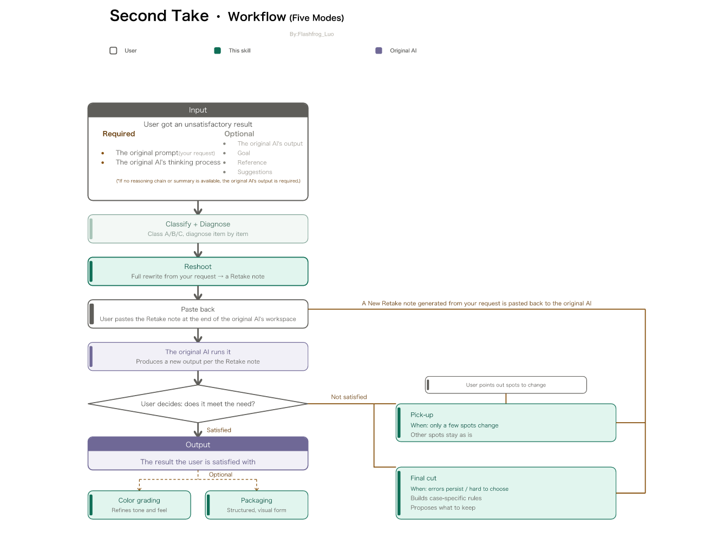

# Second Take · English Usage Manual

> **QA for AI reasoning · retake notes** — turn a disappointing chain of thought into a better answer.

🇬🇧 **English (this page)** ｜ 🇨🇳 [中文](README.md)

> Got an AI answer you're not happy with? Just say "second take" — but this time, bring the retake note.

[](https://github.com/flashfrogluo/second-take)
[](LICENSE)
[](CHANGELOG.md)
[](https://agentskills.io)
[](https://github.com/flashfrogluo/second-take/releases)
[](https://github.com/flashfrogluo/second-take/commits/main)
[](https://github.com/flashfrogluo/second-take/actions/workflows/ci.yml)

This is the detailed English guide for **Second Take**, a skill that reviews another AI's reasoning and produces a precise instruction you can paste straight back into the original chat.

If you came from the Chinese README, every section there carries a one-line **EN** note. This document is the complete, expanded English version.

---

## What Second Take does

You got a disappointing result from any AI — **DeepSeek, ChatGPT, Doubao, Gemini, Jimeng, Midjourney…** — and the result can be **text, image, video, prompt, code… anything at all**. Send it the requirement or a share link to the conversation. It then does two things: it reads that reasoning (or, for generative models, the prompt), judges what went wrong, and **produces a retake note you can copy straight back into that AI** — paste it at the end of the original conversation and the other AI gives you a better final answer directly.

```bash
npx skills add flashfrogluo/second-take
```

> ⭐ **If this skill is useful to you, please hit Star** — it lands in your Stars list so you can find it again; hit **Watch** to subscribe to releases and discussions.<br>
> Installs are counted via `npx skills add` CLI telemetry (opt out with `DISABLE_TELEMETRY=1`). Each install is recorded once — one install from you is the most direct feedback.

**Why "Second Take":** the word *take* has two meanings — in film it means "one shot" (let's do another take), and it also means "an opinion or interpretation" (my take on this). The name captures both things we do: **offer a second opinion, then let the original AI reshoot once.**

🌐 **At a glance** (how it runs, what it produces) — [English](https://flashfrogluo.github.io/second-take/index-en.html) · [中文](https://flashfrogluo.github.io/second-take/)

For DeepSeek, use [`prompts/for-deepseek-en.md`](prompts/for-deepseek-en.md) — tuned for its thinking mode; for other platforms use [`prompts/abc-en.md`](prompts/abc-en.md). Chinese readers: `prompts/for-deepseek.md` and `prompts/abc.md`.

---

## Try it in 30 seconds (no install)

Copy [`prompts/for-deepseek-en.md`](prompts/for-deepseek-en.md) in full and send it as the first message of a new chat, then paste the result you are unhappy with together with the thinking process behind it.

Want the full version (11 reference documents + a 43-item self-check rubric + five modes)? Install it:

```bash
npx skills add flashfrogluo/second-take
```

> ⭐ **If it helped, hit Star** — it lands in your Stars list so you can find it again; hit **Watch** to follow updates. Right now that is the only signal telling me someone is using it.

---

## One complete round-trip

```
You  →  Paste a disappointing AI output, or its conversation share link
It   →  ① A dozen-odd-line diagnosis: which rule broke, which class, overall score by the Four Standards
        ② A retake note (code block, fully copyable)
You  →  Paste the retake note at the end of the original AI's conversation
That AI → Gives a better final answer directly
```

The key is **you don't rewrite the question**: all context, history, and expression habits in the original conversation are preserved; only that failing stretch of reasoning is cut.

---

## A 30-second walkthrough: the shortest demo

**Input**: a user asks for "three composition tips for beginners". An AI's thinking process says "according to the persistence-of-vision principle, the rule of thirds makes an image read better", and it gives only two tips.

**Diagnosis (excerpt)**
- **Unsupported citation (borrowed from another field)**: it uses "persistence of vision", a physiological phenomenon explaining why moving images look continuous, as the basis for a static-composition rule — an unrelated transplant.
- **Incomplete coverage**: the request explicitly asked for three tips; only two were given.

**Retake note (copy the whole block, paste at the end of the original chat)**
> Ignore the thinking process from the previous turn in this conversation and the answer it directly produced; all other instructions remain in force. Rewrite "three composition tips for beginners": 1) rule of thirds… 2) leading lines… 3) negative space…. Do not use unrelated cross-domain reasoning such as "persistence of vision"; output the body text only, with no analysis.

**Result**: the original AI returns three tips with actionable points, and no transplanted reasoning.

---

## Deliverables

**One retake note.** Paste it at the end of the original conversation; the other AI gives the final answer directly — it will not hand you back another "analysis" or "suggestions".

Before writing the note it runs a short diagnosis (which step was wrong, which family of error it belongs to, an overall score against the Four Standards). That part is internal — it costs you no extra step. All you do is copy the note.

This skill **does not** write the answer for you. Your context lives in that AI's conversation, so you must get the result there. If you want it to write directly, just say "write it directly."

The retake note is self-contained: the full user instruction is embedded, so copying the whole block works with no surrounding context.

It does **not** embed the original thinking process. That is where the guessing and the thinking-aloud tone come from — pasted in, the model simply replays it.

It gives four things: the user instruction, a list of valid conclusions (the judgments from the thinking process that still hold), the required changes, and an output skeleton (how many sections, what each covers, how long — conclusions first, key points in bold) plus output requirements (including the ban on thinking-aloud tone).

What to produce is decided by the UP, not guessed: if the UP is a question or asks for content, produce the **final answer**; if the UP's deliverable *is* the reasoning itself (in prompt engineering, the CoT is the product), produce the **revised CoT**. Both templates are in `references/标注范例.md` (Annotation Examples).

Just paste it at the **end of the original conversation** — no new chat needed. The retake note begins with a **targeted-ignore declaration**: it only cuts that one failing stretch of deep thinking and the single answer it directly produced; your earlier instructions, added requirements, expression habits, and ways of thinking all remain in effect.

This method is domain-agnostic. Its review logic has nothing to do with "what the product is" — copy, plans, code, analysis conclusions, and scoring rubrics all apply equally. Every rule in this skill is abstracted to keep only mechanisms that hold across domains; nothing tied to a single domain is written in.

---

## Treat one AI generation like shooting a film (vocabulary & control panel)

> This method **packages** the whole review pipeline into film-making terms: you do not need to learn AI jargon — just recognise the film words below and you can name the exact step you want.
> **The table below is everything you can name.**



| Mode / deliverable | When to use it | What it does | Words to name it |
|---|---|---|---|
| **Reshoot / 重拍** | First round, or when the subject does not hold | Full rewrite | `reshoot` · start over · rewrite from scratch · full rewrite · this version is completely wrong · redo it · another take |
| **Pick-up / 补拍** | Second round onwards, subject already holds | Change only the named spots; keep everything else as it is | `pick-up` · change it from this version · just fix these spots · add a bit · keep this version · tweak · iterate |
| **Final cut / 定剪** | Deadlock after several rounds, or two versions contradict each other | Stop rewriting; make a trade-off call | `final cut` · pick one for me · which one · lock it · make the call · settle it · merge the conflict |
| **Color grading / 调色** | Subject is already perfect (Four Standards met, no check-item problems); only texture / style is missing | Touch neither structure nor facts; polish and strengthen style only | `color grading` · polish it · adjust the tone · more visual · unify the style · sharpen it · raise the quality · beautify |
| **Packaging / 包装** | Already meets the output bar and needs to be structured so it reads at a glance | Visual analysis: summary, mind map, charts | `packaging` · make a chart · visualise it · mind map · comparison table · infographic · dashboard |
| **Retake note** | Every step above produces one — this is **the sheet the tool hands you** | It is essentially an **optimization & checking instruction** — it carries both the changes to make and check items that can be judged pass/fail. One block you copy in full and paste back into the original chat; the other AI answers better from it

**To invoke it, you do not need to name a mode — just say:**

| Intent | Trigger words |
|---|---|
| Unhappy result (QA) | the result is wrong / not usable / misses points / wrong length / sounds robotic / too much AI flavor / wrong format / off-topic / logic is flawed / self-contradictory |
| Hand me material to diagnose | check this reasoning / diagnose this CoT / where did this thinking go wrong / here's a share link / my prompt produces a bad image |
| Optimize / rewrite | improve the prompt / have the original AI redo it / spot errors / review / re-examine / rewrite the CoT / QA it with this rubric |
| Generative platforms | JiMeng / Kling / Midjourney image is wrong / not the frame I wanted / prompt retake note |

**The first three settle "is it right"; color grading settles "is it good enough"; packaging settles "does it read clearly".**

> **Neither color grading nor packaging re-judges the conclusion** — they rest on "the subject already holds". If the Four Standards are not all met yet, run the first three first.
>
> **From round two on, Pick-up is the default**: the biggest risk of a rewrite is not writing it badly, but **throwing away the parts of the previous version that were already fine**.

> 📌 **On the name.** The deliverable is called a **retake note** (重拍单). Essentially it is an **optimization & checking instruction** — it states what to change and carries check items that can be judged pass/fail. It is self-contained: paste it and it works, no surrounding context needed.

> ⚠️ **One boundary**: these film terms are the **command interface for invoking this tool**, not the content of the task you hand the AI. If your own work happens to be film-making and the words "reshoot" or "color grading" appear in your brief, that is just your domain language and will not trigger a step — triggering only happens when you actively use this tool.

**The remaining film words are not modes and cannot be named** — they are step names that show up in the diagnosis:

| Film word | What it refers to |
|---|---|
| **Dailies / 样片** | The material under review: the original AI's reasoning chain and final answer |
| **Continuity / 穿帮** | Self-consistency check — **a check item, not a mode** |
| **Missing coverage / 漏镜** | Incomplete coverage — **a check item, not a mode** |

> These two are **check items** — they describe what is wrong with the reasoning, not modes you can name, so they never appear as trigger words.

## Default to the light version

By default you get the **light version**: the diagnosis is still done item by item, but the delivery is kept to what you actually need — most often a **targeted fix** (the previous version holds, so the good parts stay and only a few spots change).

Ask for the **full version** any time by saying "this is important / go deeper / dig into it"; or, when the problem is clearly structural (several things are wrong, the direction is off, or you have already been through several rounds), the tool will go straight to the full version — full rewrite, item-by-item diagnosis and the draft self-check included.

## Installation

```bash
npx skills add flashfrogluo/second-take
```

One line installs it into your agent — the installer asks you to pick a target. **What is supported depends on your version of the `skills` CLI** (the list changes between releases; the install prompt shows yours).

> **Share the link, do not ask people to search.** Searching `second-take` collides with same-substring names (scrump / thumbnail) and loses on ranking; `second take` with a space drops into semantic search sorted by install count.

**Manual install: where each platform looks**

| Agent | Project-level | User-level |
|---|---|---|
| Claude Code | `.claude/skills/` | `~/.claude/skills/` |
| Codex CLI | `.agents/skills/` | `~/.codex/skills/` |
| Cursor | `.agents/skills/` | `~/.cursor/skills/` |
| Windsurf | `.windsurf/skills/` | `~/.codeium/windsurf/skills/` |
| Cline · Zed | `.agents/skills/` | `~/.agents/skills/` |
| Gemini CLI | `.agents/skills/` | `~/.gemini/skills/` |
| GitHub Copilot | `.agents/skills/` | `~/.copilot/skills/` |
| OpenCode | `.agents/skills/` | `~/.config/opencode/skills/` |
| Goose | `.goose/skills/` | `~/.config/goose/skills/` |
| WorkBuddy | — | `~/.workbuddy/skills/` |
| DeepSeek Harness | `.agents/skills/` | `~/.agents/skills/` |

**Most agents read `.agents/skills/`** — for a manual install that one place is usually enough.

**Prompt-only use (no install)**

Paste the body of `SKILL.md` into a chat. Prefer a ready-made one? Two **starter prompts**:

- [`prompts/for-deepseek-en.md`](prompts/for-deepseek-en.md) — tuned for DeepSeek (Type A)
- [`prompts/abc-en.md`](prompts/abc-en.md) — generic, covering Types A / B / C

> ⚠️ Both are **trimmed starters** (a subset of 14 high-frequency hard constraints; the full skill has 34). Copying solves "this once"; installing is what gets you the full check every time.

## Supported models and output types

No matter which AI you use — **DeepSeek, ChatGPT, Doubao, Qwen, Gemini, Claude, Jimeng, Kling, Midjourney, Sora, Runway…** — if you're unhappy with its result, Second Take can take it. The output types it covers are unlimited too:

- **Text:** copy, plans, code, analysis reports, scoring rubrics, papers / reports
- **Image:** generated images, posters, storyboards, covers
- **Video:** shorts, ads, storyboard previews, motion assets
- **Other artifacts:** prompts, configs, tables, and any stretch of "finished thinking but not thought through" reasoning

The only criterion: **does that AI expose its reasoning process?**

| Class | Representative AIs | What we review | What you get | Output type |
|---|---|---|---|---|
| **A Full reasoning** | DeepSeek, Qwen (thinking mode), Gemini, Doubao, Claude | That stretch of deep thinking | Retake note (paste back) | Text / Other |
| **B Reasoning summary only** | ChatGPT (thinking summary), some Doubao / Qwen share snapshots | Summary + infer backward from the product (source noted) | Retake note | Text / Other |
| **C No reasoning (generative)** | Jimeng, Kling, Midjourney, Sora, Runway | **The prompt itself** | Prompt retake note (directly pasteable) | Image / Video |

> Class C is a deliberate adaptation: generative models don't show you their reasoning, but **the prompt is the complete instruction they received** — treat it as the CoT and the root cause of a bad image / clip is equally findable (missing elements, internal conflict, adjectives not operationalized, words the platform doesn't recognize). Three rules: don't fabricate platform parameters, keep the seed and reference images, change only the elements that are actually wrong, and don't throw out the whole image.

---

## Usage

Both of the following work:

```
# Provide a link (most common)
Generate an retake note for me: https://chat.deepseek.com/share/xxxxx

# Paste content directly
Check whether this CoT is correct; if not or if it can be improved, generate an retake note for me.
UP (user instruction): ……
CoT (deep thinking): ……
```

After a link, it calls the API to fetch the original instruction, deep thinking, and that version's product, so you don't type them manually. Once fetched, it confirms with you which is the main instruction, which is the added instruction, and which is the product.

Optional inputs include: material description (Caption), target product, reference material, and instructions you add in later rounds (e.g. "no bullet points, output one long block"). Whichever is missing, the check that depends on it is simply marked "none."

Pure text Q&A with only UP and CoT and no product or material also works; the focus then falls on instruction conflict, incomplete coverage, and reasoning defects.

---

**Terms**

| Abbreviation | Meaning |
|---|---|
| UP (User Prompt) | The requirement and constraints the user gave |
| CoT (Chain of Thought) | The reasoning process under review |
| Caption | A text description of the target product or reference material |

---

## What to provide per output type (for the most accurate diagnosis)

The more precise your information, the more precise the diagnosis. Provide the following by output type; you can still run with gaps and fill in later:

| Output you're reviewing | Provide if possible (more = better) | Purpose |
|---|---|---|
| **Text / code / plan** | ① Original user instruction (UP) ② That stretch of deep thinking (CoT) ③ The final answer it gave | CoT is the main evidence; UP checks "which requirement was dropped"; the answer confirms "did the error reach the result" |
| **Summary only (ChatGPT, etc.)** | ① UP ② Thinking summary ③ Final product | Main evidence becomes the product; conclusions note "inferred from product" and state "full reasoning not seen, coverage may be low" |
| **Image / video (generative)** | ① The effect you expected (UP) ② The prompt used (params / seed / reference) ③ This version's output | The prompt is the reasoning; seed / reference decide whether we can "change only the broken element" |
| **With reference / target material** | ① Target (the look you expected) ② Reference (take the one dimension it was named for) ③ The AI artifact to fix | Keep the three distinct to avoid the "loop": if you treat the AI artifact as the standard, every fix makes it more like the original error |
| **Any type** | One line "what you're unhappy about" | Helps us finish the judgment first and take fewer detours; if unstated we infer from UP and product |

---

## Evaluation standard: the Four Standards for an effective chain of thought

Whether a chain of thought is effective is judged by four standards. **The Four Standards are the evaluation standard; the check items are the symptom list** — the former answers "is it good," the latter answers "where is it broken."

| Standard | Definition | One-line test |
|---|---|---|
| **Logic** | Each thinking step has a logical relation to the others, connected into a complete process | Can the next step be inferred from the previous one? |
| **Completeness** | Considers the problem as fully and carefully as possible, ignoring no relevant factor or impact | Are the important dimensions mentioned in the UP and material all accounted for? |
| **Feasibility** | Every thinking step can actually be carried out | After reading, do you know the specific next action? |
| **Verifiability** | Every thinking step can be validated by real data and facts | Can each conclusion point to "why do you say so"? |

Process: first find the concrete errors via the check items → map them to the Four Standards → give an overall score → write the retake note from that. The revision points must cover all four; fill whichever is missing.

For per-standard judgment methods and the mapping to check items, see `references/思维链四标准.md` (The Four Standards for Chain of Thought).

---

## Symptom list (check items)

The skill automatically scans for three families of problems — you don't need to memorize these terms:

- **Conflicts**: the product, reference material, or user instruction contradicts one another (product / reference / instruction conflict);
- **Incomplete coverage**: important content of the user instruction was dropped or weakened;
- **Reasoning defects**: contradiction, common-sense error, vague wording, forced reasoning, unsupported citation, self-clearance, version regression, and so on.

The full itemized list and per-item judgment methods live in `references/思维链四标准.md`.

---

## The three segments at the end of the retake note (hybrid mode)

The retake note doesn't end after the requirements; three segments follow, in fixed order:

| Segment | Written by | Purpose |
|---|---|---|
| **[Judging Criteria]** | The target AI, per our spec | Define "what good means in this domain" up front, to catch errors we haven't seen |
| **[Known Defects]** | Us (seed entries) | Anchor the actual mistakes the previous version made — it doesn't know which line it deleted |
| **[Self-Check]** | Us (10–12 Yes/No items) | A unified pass after writing; answer "no" and fix on the spot; the self-check process doesn't enter the body |

Why not fix it all in the tool: the items the tool supplies are **after-the-fact** (written after seeing a bad result), so they only guard against errors already seen; its self-written items are **before-the-fact** (define the standard right after receiving the UP), guarding against unseen errors. **The two cover different error sets.**

Why not hand it all to it: it will inflate its self-score, and will **infer the standard backward from the previous bad product** (treating "last version had six sections" as the standard), writing unjudgeable items like "is the content reasonable." So the meta-instruction must have guardrails — **every item must state "on what basis," and missing basis counts as "no"**; **standards may come only from the UP and common sense, never from the look of any previous answer**; bare adjectives are forbidden.


> ⚠️ **Only [Judging criteria] and [Known defects] can be dropped. [Draft self-check] is mandatory under every template (A / B / C) and in every case** —
> it guards against "writing without reviewing", which has nothing to do with output length.
Enabled by default. Four cases fall back to giving only **[Self-Check]**: the target model is clearly weak / the UP is minimal / defects are fully enumerable / the user needs the shortest instruction.

---

## Pitfalls we've hit (all now in the hard constraints)

| Lesson | Symptom |
|---|---|
| Embedding full CoT | Output becomes a "hmm, the user is asking…" thinking process instead of an answer |
| Skeleton says only "can be sectioned" | Output is flat text with no hierarchy and no emphasis |
| Meta-requirements enter the body | Body shows "the working definition of this answer," "the judging standard is…"; reader can't tell who's being addressed |
| Fabricating numbers for "verifiability" | Invented precise polling intervals, acceptance-role names — obviously fake, collapsing the whole piece's credibility |
| Mechanical quantitative metrics | "at least two bold spots per section" → everything bold; fixed column count → fields merged pairwise |
| Lists not from one source | Revision points list seven classes, output structure lists six → model follows structure, the seventh vanishes entirely |
| **No placeholder in structure** | Requirements written only in revision points (e.g. the closing question paragraph) are never produced |
| Rewriting from scratch on iteration | Throws away qualified content the previous version already had (version regression) |
| Ignoring the whole conversation | Blanket "ignore all previous answers" also drops habits the user emphasized repeatedly |
| **Saving characters by dropping sentence parts** | "也知道" written as "也知," judgment written as "…rather than…"; reader must supply words to parse |
| Every sentence in the argument starts with "I" | Subject jumps around; objective argument degrades into subjective feeling, reads chaotically |
| Skeleton written as a bullet list | Model copies the skeleton verbatim into an outline; product becomes predicate-less phrase piles |

---

## How it differs from similar skills

The community already has many "make AI better" skills, but we're not doing the same thing:

| Category | Representative | What they do | What we do |
|---|---|---|---|
| Generation side: make AI think more | `adhd` (tree-of-thought + pruning), `Reasoning-Skill-Claude`, `auto-reasoning` | Help AI think wider and deeper **at generation time** | Review the stretch it already finished thinking **after generation** |
| Self-reflection side | `self-refine-skill` (GENERATE→CRITIQUE→REFINE→CHECK), `claude-sanity-check` | Have AI **fix its own** current output | Third-party review of **another AI's** reasoning, with a product you can paste back |
| Style side | `avoid-ai-writing` (21 AI-writing patterns), `humanizer` | Remove AI smell, tweak wording | Judge where the reasoning is wrong (missing items, contradiction, unsupported citation, constraint conflict); style is only one dimension |
| Prompt side | `prompt-architect`, `prompt-engineering-expert` | Improve **the prompt itself** | Improve the instruction to "re-answer with the original UP," while preserving the original conversation context |

One line: **what others do is make AI think one more layer, or fix its own style; Second Take does third-party QA — read another AI's already-finished reasoning, judge where it's wrong, and produce a retake note you can paste back so the original AI gives a better final answer.**

---

## FAQ

**Will it write the answer directly?**
No — by default it only gives the retake note. Your context lives in that AI's conversation, so the result has to come from there. If you want it to write directly, say "just write it".

**Why isn't the original thinking in the retake note?**
Because that thinking is the root cause. Pasted back in, the model replays it and the output turns into "So, the user is asking…".

**Will pasting back pollute the context?**
No. The retake note carries a **targeted-ignore declaration**: it drops only that previous round's thinking and the answer it produced; your earlier instructions, follow-ups and phrasing all stay in force.

**I only have a stretch of thinking, no link — can I still use it?**
Yes. Paste the user instruction and the thinking together.

**Still erroring on the third iteration?**
Switch to **Final cut**: stop rewriting and make a trade-off call. New errors after many rounds mean the problem is the trade-off, not the rewriting.

**The content is right but it feels flat — or I need to present it?**
Use **Color grading** (polish wording and style only, never structure or facts) or **Packaging** (summary, mind map, charts — ready to present).

## Privacy

- The diagnosis happens entirely inside this conversation. This skill **sends nothing to the author** and has no background collection.
- The one network call is **when you paste a share link**: your own machine requests that shared conversation from the platform (currently DeepSeek only) and hands the text to the AI you are already talking to. **It never passes through the author.**
- In other words: your content does not go to the author, but pasting a link does send it to that link's platform. Those are different things, so they are stated separately.
- The requirements, conversations, prompts, and outputs you paste are **used only for this diagnosis** — never collected, trained on, or leaked.
- If you voluntarily contribute a sanitized case (see next section), that's your **active** contribution, unrelated to automatic collection.

---

## Contributing: share your cases and corpus

The hard constraints of this skill were honed one real case at a time. **If you're willing to share an "unsatisfying result" together with its original instruction / prompt, you help us sharpen the judgments** — email **flashfrogluo@gmail.com**, or open an issue / PR in the repository.

- **Sanitize before contributing:** remove real names, client names, internal addresses, and confidential data; keep "task type + instruction + that reasoning / prompt + what you were unhappy about."
- Your cases never automatically enter the public knowledge base; only patterns abstracted into "mechanisms" flow back, and specific nouns are stripped — it helps us without leaking your business.
- Usage suggestions, testing feedback, and collaboration ideas are all welcome.

---

## About the author

**flashfrogluo** — came up in film creation (cinematography / directing / screenwriting), now working in AI creation, evaluation and development.

The motive came from the intersection of two roles: making images made me sensitive to "why is this shot wrong", while using AI daily kept surfacing one pain — the quality of a model's "deep thinking" is unstable, skipping steps or dropping dimensions the user explicitly asked for.

Suggestions, review feedback, real conversations usable as corpus, and collaboration ideas are all welcome — open an issue / PR, or email **flashfrogluo@gmail.com**.


## License

MIT. See `LICENSE`.

---

## 中文

本页的完整中文说明见 [`README.md`](README.md)。
